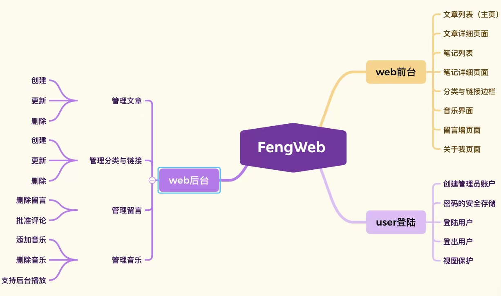

## FengWeb
Lns-XueFeng的个人网站，利用Python-Flask、Jinja2、Bootstrap进行搭建！
- flask_sqlalchemy: 操作数据库
- flask_login: 实现后台的登录
- flask_ckeditor: 实现富文本编辑器
- flask_wtf: 实现进行交互的表单
- markdown: 实现markdown文档转换为html

## 开发流程
- 数据库建模
- 编写表单类
- 编写视图函数和相关处理函数
- 在页面中使用jinja2替换数据

## 网站外观


## 项目目录
```
fengweb
     blueprints
         --- __init__.py
         --- blog.py
         --- admin.py
         --- auth.py
     static
         --- js
         --- css
         --- images
         --- musics
         --- markdown
         --- ckeditor
     templates
         --- blog
         --- auth
         --- admin
         --- error
         --- base.html
     __init__.py
     commands.py
     extensions.py
     forms.py
     models.py
     settings.py
     utils.py 
```

## 功能安排

